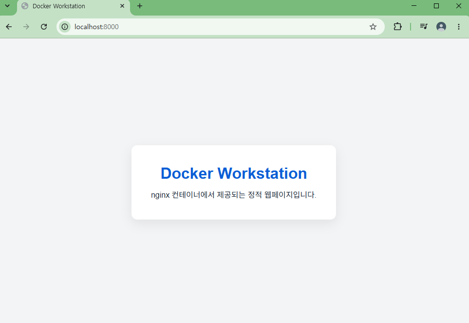
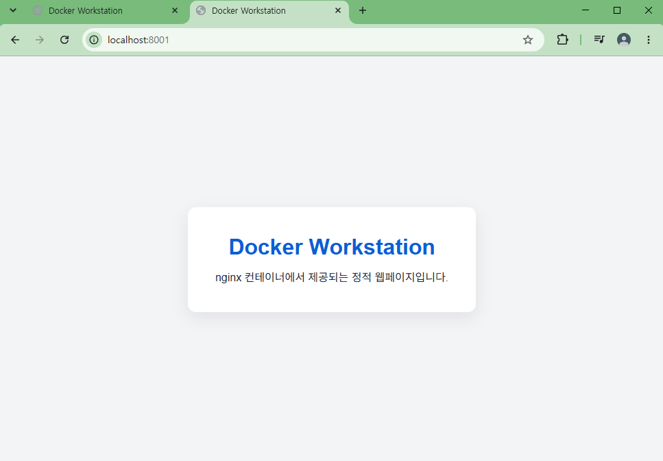
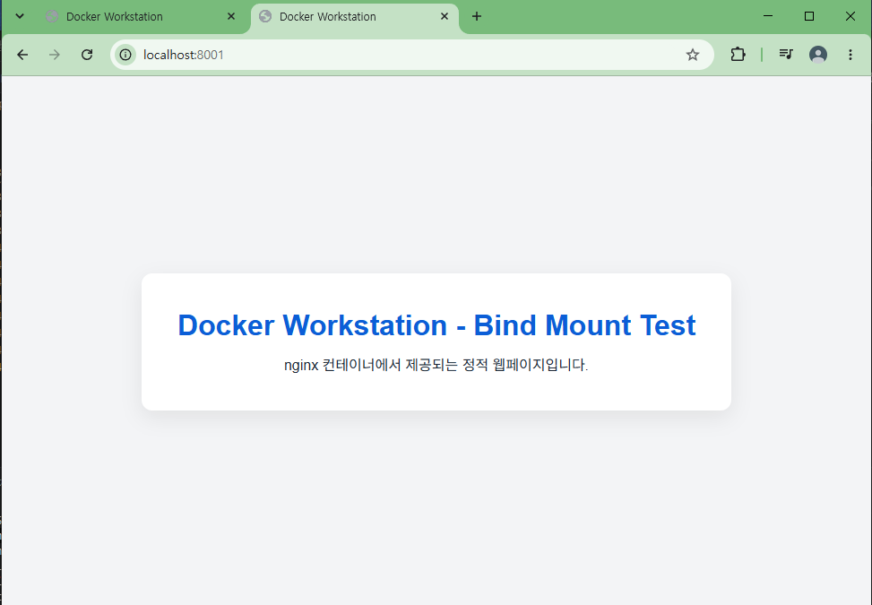
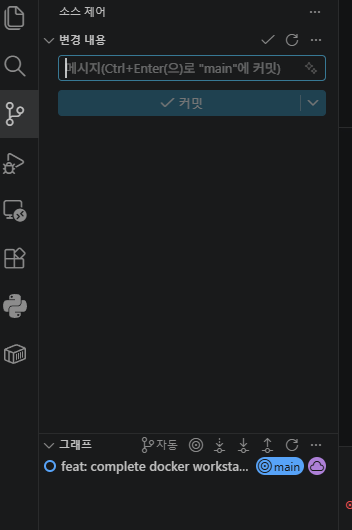

# Docker Workstation

## 1. 프로젝트 개요

개발 워크스테이션 구축 미션을 수행하며 터미널 조작, Linux 권한, Docker 컨테이너, 네트워크 포트, 스토리지와 Git의 기본 사용법을 실습한 프로젝트입니다.

개발과 실행 검증은 Windows Docker Desktop에서 진행했습니다. 프로젝트 내부 파일은 상대경로로 참조하고 웹 서버는 Docker 이미지로 구성하여 호스트 절대경로에 의존하지 않도록 했습니다.

## 2. 실행 환경

| 구분 | 환경 |
| --- | --- |
| OS | Windows |
| Shell | PowerShell |
| Container runtime | Docker Desktop |
| Docker | Docker version 29.5.2 |
| Git | Git version 2.54.0.windows.1 |

버전 확인에 사용한 명령은 다음과 같습니다.

```powershell
docker --version
git --version
```

## 3. 수행 체크리스트

- [x] 터미널 기본 조작
- [x] 권한 실습
- [x] Docker 설치 및 점검
- [x] `hello-world` 컨테이너 실행
- [x] Ubuntu 컨테이너 실습
- [x] Dockerfile 작성
- [x] 포트 매핑
- [x] 바인드 마운트
- [x] Docker Volume
- [x] Git 설정
- [x] GitHub 원격 저장소 연동 및 push

### 3.1 터미널 기본 조작 로그

#### 현재 위치 확인

```bash
pwd
```

```text
/
```

#### 숨김 파일을 포함한 목록 확인

```bash
ls -la
```

```text
숨김 항목을 포함한 현재 디렉터리 목록을 확인함 (전체 출력 생략)
```

#### 디렉터리 생성 및 이동

```bash
mkdir cli-practice
cd /cli-practice
```

```text
출력 없음
```

#### 파일 및 디렉터리 생성

```bash
touch hello.txt
mkdir testdir
```

```text
출력 없음
```

#### 파일 내용 작성 및 확인

```bash
echo "hello docker" > hello.txt
cat hello.txt
```

```text
hello docker
```

#### 파일 복사

```bash
cp hello.txt copy.txt
```

```text
출력 없음
```

`copy.txt`가 생성된 것을 확인했습니다.

#### 파일 이동 또는 이름 변경

```bash
mv copy.txt renamed.txt
```

```text
출력 없음
```

`copy.txt`가 `renamed.txt`로 이름 변경된 것을 확인했습니다.

#### 파일 및 디렉터리 삭제

```bash
rm renamed.txt
rmdir testdir
```

```text
출력 없음
```

삭제 후 `renamed.txt`와 `testdir`이 사라진 것을 확인했습니다.

## 4. Docker 설치 및 점검

Docker CLI 버전과 Docker Engine 상태를 다음 명령으로 점검했습니다.

```powershell
docker --version
docker info
```

설치 점검 후 테스트 이미지를 실행했고, `hello-world`가 정상적으로 실행되는 것을 확인했습니다.

```powershell
docker run hello-world
```

### 4.1 Docker 기본 운영 명령 로그

#### 이미지 목록 확인

```powershell
docker images
```

```text
REPOSITORY           TAG
docker-workstation   1.0
hello-world          latest
nginx                alpine
ubuntu               latest
```

#### 실행 중인 컨테이너 확인

```powershell
docker ps
```

```text
NAME          IMAGE          PORTS        STATUS
docker-bind   nginx:alpine   8001 -> 80   Up
```

#### 전체 컨테이너 확인

```powershell
docker ps -a
```

```text
NAME                    STATUS    PORTS
cli-test                Exited
permission-test         Exited
vol-test2               Exited
docker-bind             Up        8001 -> 80
docker-web              Up        8000 -> 80
Ubuntu 실습 컨테이너   Exited
hello-world 컨테이너    Exited
```

#### 컨테이너 로그 확인

```powershell
docker logs docker-web
```

```text
nginx configuration complete; ready for start up
nginx/1.31.3
start worker processes
GET / HTTP/1.1 -> 200 또는 304 응답
favicon.ico -> 404
```

nginx가 정상적으로 시작되었고 `/` 요청을 성공적으로 처리했습니다. `favicon.ico`의 404 응답은 브라우저가 아이콘 파일을 별도로 요청하면서 발생한 것으로, 웹페이지 동작에는 영향을 주지 않았습니다.

#### 컨테이너 자원 사용량 확인

```powershell
docker stats --no-stream
```

```text
NAME          CPU %    MEM USAGE
docker-bind   0.00%    약 10.19 MiB
docker-web    0.00%    약 15.04 MiB
```

#### 컨테이너 중지 및 삭제

실행 중인 컨테이너를 중지하고 상태 변화를 확인한 뒤 삭제했습니다.

```powershell
docker run -d --name stop-test ubuntu sleep infinity
docker ps
docker stop stop-test
docker ps -a
docker rm stop-test
```

실행 직후 `docker ps`에서 `stop-test`가 `Up` 상태인 것을 확인했습니다. `docker stop stop-test` 실행 후에는 `docker ps -a`에서 `Exited` 상태로 표시되었습니다.

`docker stop`은 컨테이너의 실행을 중지하지만 컨테이너 자체를 바로 삭제하지는 않습니다. 따라서 중지된 컨테이너도 `docker ps -a`에서 확인할 수 있으며, 더 이상 필요하지 않을 때 `docker rm stop-test`로 삭제했습니다.

## 5. Ubuntu 컨테이너 실습

Ubuntu 컨테이너를 대화형 셸로 실행한 뒤 현재 경로와 디렉터리 내용을 확인하고, 문자열을 출력한 후 종료했습니다.

```powershell
docker run -it ubuntu bash
```

컨테이너 내부에서 수행한 명령입니다.

```bash
pwd
ls
echo "hello ubuntu"
exit
```

### 5.1 `docker run`과 `docker exec`의 종료 차이

실행 상태를 유지하는 Ubuntu 컨테이너를 만든 뒤 `docker exec`로 추가 bash 프로세스를 실행했습니다.

```powershell
docker run -d --name exec-test ubuntu sleep infinity
docker ps
docker exec -it exec-test bash
```

컨테이너 내부에서 다음 명령을 실행하고 bash를 종료했습니다.

```bash
echo "exec test"
exit
```

출력:

```text
exec test
```

이후 상태를 다시 확인했습니다.

```powershell
docker ps
```

`exec-test`가 계속 `Up` 상태인 것을 확인했습니다.

- `docker run -it ubuntu bash`에서는 bash가 컨테이너의 메인 프로세스입니다. bash에서 `exit`하면 메인 프로세스가 끝나므로 컨테이너도 종료됩니다.
- `docker run -d ... sleep infinity`에서는 `sleep infinity`가 메인 프로세스입니다. `docker exec`로 추가 실행한 bash에서 `exit`해도 메인 프로세스는 계속 실행되므로 컨테이너는 `Up` 상태를 유지합니다.
- `docker exec`는 이미 실행 중인 컨테이너 안에서 추가 명령이나 프로세스를 실행하는 명령입니다.

실습 후 컨테이너를 정리했습니다.

```powershell
docker rm -f exec-test
```

## 6. 커스텀 웹 서버

### Dockerfile

```dockerfile
FROM nginx:alpine

COPY app/ /usr/share/nginx/html/
```

`nginx:alpine`은 정적 파일 제공에 필요한 nginx를 포함하면서 이미지 크기가 비교적 작아 간단한 웹 서버 실습에 적합합니다. 프로젝트의 `app/index.html`을 nginx 기본 웹 루트인 `/usr/share/nginx/html/`로 복사하여 별도의 웹 서버 설정 없이 기본 페이지로 제공되도록 구성했습니다.

이미지 빌드와 컨테이너 실행에는 다음 명령을 사용했습니다.

```powershell
docker build -t docker-workstation:1.0 .
docker run -d -p 8000:80 --name docker-web docker-workstation:1.0
```

호스트의 `8000`번 포트를 컨테이너의 `80`번 포트에 연결했습니다. 브라우저에서 `http://localhost:8000`으로 접속하여 `Docker Workstation` 페이지가 표시되는 것을 확인했습니다.

## 7. 포트 매핑 증거

호스트 `8000`번 포트에서 컨테이너의 nginx 웹 서버로 접속한 결과입니다.



## 8. 바인드 마운트 검증

호스트의 `app` 폴더를 컨테이너의 `/usr/share/nginx/html`에 바인드 마운트하고, 이미지 재빌드 없이 파일 변경이 반영되는지 확인했습니다. 기존 컨테이너와 포트가 겹치지 않도록 호스트 포트 `8001`을 사용했습니다.

```powershell
docker run -d -p 8001:80 --name docker-bind -v "${PWD}/app:/usr/share/nginx/html" nginx:alpine
```

`${PWD}`를 사용하므로 특정 Windows 절대경로에 의존하지 않습니다. `app/index.html` 변경 전과 변경 후에 `http://localhost:8001`을 확인했고, 호스트에서 수정한 내용이 브라우저에 반영되는 것을 확인했습니다.

변경 전:



변경 후:



## 9. Docker Volume 영속성 검증

먼저 `mydata` Volume을 만들고 목록에서 생성 여부를 확인했습니다.

```powershell
docker volume create mydata
docker volume ls
```

Volume을 `/data`에 연결한 Ubuntu 컨테이너를 실행한 뒤 파일을 작성하고 내용을 확인했습니다.

```powershell
docker run -d --name vol-test -v mydata:/data ubuntu sleep infinity
docker exec vol-test bash -c "echo hello-volume > /data/hello.txt"
docker exec vol-test cat /data/hello.txt
```

출력:

```text
hello-volume
```

첫 번째 컨테이너를 삭제한 다음 동일한 Volume을 연결한 새 컨테이너를 실행했습니다.

```powershell
docker rm -f vol-test
docker run -d --name vol-test2 -v mydata:/data ubuntu sleep infinity
docker exec vol-test2 cat /data/hello.txt
```

출력:

```text
hello-volume
```

첫 번째 컨테이너를 삭제했음에도 `mydata` Volume을 연결한 두 번째 컨테이너에서 같은 파일을 읽을 수 있었습니다. 이를 통해 컨테이너 생명주기와 독립적으로 Volume 데이터가 유지되는 것을 확인했습니다.

## 10. 권한 실습

Ubuntu 컨테이너 내부에서 파일과 디렉터리의 권한을 변경하고 `ls -ld`로 결과를 확인했습니다.

```bash
touch test.txt
mkdir testdir

chmod 600 test.txt
chmod 700 testdir
ls -ld test.txt testdir
```

확인한 권한 형태:

```text
-rw------- test.txt
drwx------ testdir
```

이후 원래 권한으로 변경했습니다.

```bash
chmod 644 test.txt
chmod 755 testdir
ls -ld test.txt testdir
```

확인한 권한 형태:

```text
-rw-r--r-- test.txt
drwxr-xr-x testdir
```

권한 문자의 의미는 `r`이 읽기(read), `w`가 쓰기(write), `x`가 실행 또는 디렉터리 접근(execute)입니다. 숫자는 소유자, 그룹, 기타 사용자의 권한을 차례로 나타냅니다.

| 권한 | 의미 |
| --- | --- |
| `600` | 소유자만 읽기와 쓰기 가능 |
| `644` | 소유자는 읽기/쓰기, 나머지는 읽기 가능 |
| `700` | 소유자만 읽기/쓰기/실행 가능 |
| `755` | 소유자는 모든 권한, 나머지는 읽기/실행 가능 |

실습 과정에서 `test.txt`는 `644 → 600 → 644`, `testdir`은 `755 → 700 → 755`로 변경했습니다.

## 11. 트러블슈팅

### 11.1 호스트 포트 충돌

- 문제

  기존 `docker-web` 컨테이너가 호스트의 `8000`번 포트를 사용하는 상태에서, 다른 nginx 컨테이너도 같은 포트로 실행하려고 하자 포트 충돌이 발생했습니다.

  ```powershell
  docker run -d -p 8000:80 --name port-conflict-test nginx:alpine
  ```

- 원인 가설

  `-p 8000:80`은 호스트의 `8000`번 포트를 컨테이너의 `80`번 포트에 연결한다는 의미입니다. 하나의 호스트 포트는 동시에 여러 컨테이너에 연결할 수 없으므로, 이미 `docker-web`이 사용 중인 `8000`번 포트를 새 컨테이너가 다시 사용할 수 없다고 판단했습니다.

- 확인 방법

  실행 중인 컨테이너와 포트 매핑을 확인했습니다.

  ```powershell
  docker ps
  ```

  확인 결과 `docker-web` 컨테이너가 호스트 `8000`번 포트에서 컨테이너 `80`번 포트로 연결된 상태로 실행 중이었습니다.

- 해결 방법

  새 nginx 컨테이너에는 충돌하지 않는 호스트 포트 `8002`를 할당했습니다. 컨테이너 내부의 nginx 포트는 그대로 `80`을 사용했습니다.

  ```powershell
  docker run -d -p 8002:80 --name port-conflict-test nginx:alpine
  ```

- 결과

  `docker ps`에서 `port-conflict-test`가 `8002 -> 80` 포트 매핑으로 정상 실행되는 것을 확인했습니다. 테스트가 끝난 뒤 다음 명령으로 컨테이너를 정리했습니다.

  ```powershell
  docker rm -f port-conflict-test
  ```

### 11.2 웹 파일 수정 내용이 기존 컨테이너에 반영되지 않음

- 문제

  `app/index.html`을 수정하고 브라우저를 새로고침했지만, 기존 `docker-web` 컨테이너가 제공하는 화면에는 변경 내용이 반영되지 않았습니다.

- 원인 가설

  Dockerfile의 `COPY` 명령은 `docker build`를 실행하는 시점에 `app/`의 파일을 이미지 내부로 복사합니다. 이미지는 컨테이너를 만드는 기준이 되는 고정된 결과물이므로, 이후 호스트의 `index.html`을 수정해도 이전 이미지와 그 이미지로 만든 기존 컨테이너는 자동으로 바뀌지 않습니다.

- 확인 방법

  현재 실행 중인 컨테이너와 로컬에 생성된 이미지를 확인했습니다.

  ```powershell
  docker ps
  docker images
  ```

  확인 결과 기존 `docker-web` 컨테이너가 수정 전에 빌드된 이미지로 계속 실행 중이었습니다.

- 해결 방법

  수정된 웹 파일이 이미지에 포함되도록 이미지를 다시 빌드하고, 기존 컨테이너를 삭제한 뒤 새 이미지로 컨테이너를 다시 생성했습니다.

  ```powershell
  docker build -t docker-workstation:1.0 .
  docker rm -f docker-web
  docker run -d -p 8000:80 --name docker-web docker-workstation:1.0
  ```

- 결과

  브라우저에서 `http://localhost:8000`을 새로고침한 후 수정된 웹페이지 내용이 표시되는 것을 확인했습니다. 이 과정을 통해 Dockerfile로 복사한 파일을 변경할 때는 이미지 재빌드와 컨테이너 재생성이 필요하다는 점을 확인했습니다.


## 12. Git 설정

Git 사용자 이름과 이메일을 설정하고, 새 저장소의 기본 브랜치가 `main`이 되도록 구성했습니다. 개인정보 보호를 위해 실제 이름과 이메일 값은 문서에 기록하지 않았습니다.

```powershell
git config --global user.name "<사용자 이름>"
git config --global user.email "<이메일 주소>"
git config --global init.defaultBranch main
git init
```

로컬 Git 저장소를 초기화한 뒤 GitHub 원격 저장소를 연결하고 `main` 브랜치를 push했습니다.

### 12.1 Git 설정 검증 로그

Git 설정을 검증하기 위해 다음 명령을 실제로 실행했습니다.

```powershell
git config --list
```

```text
user.name=<사용자 이름 마스킹>
user.email=<이메일 주소 마스킹>
init.defaultbranch=main
```

전체 출력 중 과제 검증에 필요한 핵심 설정만 발췌했으며, 실제 사용자 이름과 이메일 주소는 노출하지 않고 마스킹했습니다. 실제 출력에는 설정 범위에 따라 `init.defaultbranch=master`와 `init.defaultbranch=main`이 모두 존재했지만, 현재 설정한 기본 브랜치가 `main`임을 확인했습니다.

### 12.2 GitHub 및 VS Code 연동

GitHub Repository: [gareal2117/codyssey-mission01-docker-workstation](https://github.com/gareal2117/codyssey-mission01-docker-workstation)

로컬 저장소에 GitHub 원격 저장소를 등록하고 연결 정보를 확인한 뒤 `main` 브랜치를 push했습니다.

최초 GitHub 연결에는 HTTPS remote를 사용했으며, 이후 보너스 과제 14.5에서 origin을 SSH 방식으로 변경했습니다.

```powershell
git remote add origin https://github.com/gareal2117/codyssey-mission01-docker-workstation.git
git remote -v
git push -u origin main
```

`git remote -v` 확인 결과:

```text
origin  https://github.com/gareal2117/codyssey-mission01-docker-workstation.git (fetch)
origin  https://github.com/gareal2117/codyssey-mission01-docker-workstation.git (push)
```

push 결과:

```text
main -> main push 성공
local main branch가 origin/main을 tracking하도록 설정됨
```

VS Code의 Source Control 화면에서도 현재 프로젝트가 Git으로 관리되고 있으며 `main` 브랜치를 사용하고 있음을 확인했습니다.



## 13. 재현 방법

저장소를 clone한 후 프로젝트 루트로 이동하여 다음 명령을 실행합니다.

```powershell
git clone https://github.com/gareal2117/codyssey-mission01-docker-workstation.git
cd codyssey-mission01-docker-workstation
docker build -t docker-workstation:1.0 .
docker run -d -p 8000:80 --name docker-web docker-workstation:1.0
```

브라우저에서 `http://localhost:8000`에 접속하면 정적 웹페이지를 확인할 수 있습니다.

실행 검증은 Windows Docker Desktop에서 수행했습니다. Dockerfile의 `COPY app/ /usr/share/nginx/html/`은 Docker 빌드 컨텍스트 기준 상대경로를 사용하므로 `C:\...` 같은 호스트 절대경로에 의존하지 않습니다.

### 13.1 핵심 개념 정리

| 개념 | 차이 |
| --- | --- |
| 절대경로 vs 상대경로 | 절대경로는 드라이브나 루트부터 시작하는 전체 위치이고, 상대경로는 현재 위치를 기준으로 합니다. 이 프로젝트의 Dockerfile은 호스트별 절대경로 대신 프로젝트 기준 상대경로를 사용합니다. |
| Docker 이미지 vs 컨테이너 | 이미지는 컨테이너를 만들기 위한 읽기 전용 실행 설계도이고, 컨테이너는 그 이미지로 생성되어 실제로 실행되거나 중지되는 인스턴스입니다. |
| `docker run` vs `docker exec` | `run`은 이미지에서 새 컨테이너를 만들고 실행하며, `exec`는 이미 실행 중인 컨테이너 안에서 추가 명령을 실행합니다. |
| bind mount vs Docker Volume | bind mount는 호스트의 특정 파일·폴더를 직접 연결하고, Volume은 Docker가 관리하는 저장 공간을 연결합니다. 둘 다 컨테이너 밖에 데이터를 유지할 수 있지만 관리 주체와 위치가 다릅니다. |
| Git vs GitHub | Git은 로컬에서 버전 이력을 관리하는 도구이고, GitHub는 Git 저장소를 원격으로 호스팅하여 백업과 공유·협업을 지원하는 서비스입니다. |

## 14. 보너스 과제

보너스 과제에서는 기존 Dockerfile과 정적 웹페이지를 재사용하여 Docker Compose 구성, 멀티 컨테이너 통신, 운영 명령, 환경 변수 전달과 GitHub SSH 인증을 실습했습니다.

### 14.1 Docker Compose 기초

#### 개념

Docker Compose는 컨테이너의 이미지, 빌드 방법, 포트, 환경 변수와 서비스 관계를 하나의 YAML 파일로 정의하고 프로젝트 단위로 관리하는 도구입니다. 옵션을 매번 입력하는 `docker run`과 달리 Compose는 실행 구성을 `compose.yaml`에 보관하므로 같은 환경을 반복해서 만들기 쉽습니다.

#### 구성/설정

- `services`: Compose가 관리하는 서비스 목록
- `web`: 기존 Dockerfile로 nginx 웹 이미지를 빌드하는 서비스
- `helper`: 서비스 간 통신을 확인하는 Alpine Linux 보조 서비스
- `build`: 프로젝트 루트를 빌드 컨텍스트로 사용하고 기존 Dockerfile을 지정
- `ports`: `.env`의 `WEB_PORT=8003`을 nginx의 `80`번 포트에 연결
- `environment`: `WORKSTATION_MESSAGE`를 `web` 컨테이너에 전달

#### 실제 실행 명령

```powershell
Copy-Item .env.example .env
docker compose config
docker compose up -d
docker compose ps
```

전체 구성 검증 후 `web` 서비스만 지정하여 실행하는 방법도 확인했습니다.

```powershell
docker compose up -d web
docker compose ps
docker compose down
```

#### 실제 확인 결과

- `compose.yaml` 문법 검증에 성공했습니다.
- `docker-workstation-web` 이미지 빌드에 성공했습니다.
- `docker-workstation_default` 네트워크가 생성되었습니다.
- 전체 구성인 `docker compose up -d` 실행 결과, `docker-workstation-web-1`과 `docker-workstation-helper-1`이 모두 `Up` 상태였습니다.
- `web` 서비스는 호스트 `8003`번 포트에서 컨테이너 `80`번 포트로 연결되었습니다.
- 이와 별도로 `docker compose up -d web`을 실행해 `web` 서비스만 실행되는 상태를 확인한 뒤 `docker compose down`으로 정리했습니다. 이를 통해 Compose에서 단일 서비스를 선택해 실행할 수 있음을 검증했습니다.

```text
docker-workstation-web-1       Up    8003 -> 80
docker-workstation-helper-1    Up
```

#### 배운 점

Compose 파일에 실행 설정을 기록하면 이미지 빌드, 네트워크 생성과 여러 서비스 시작을 하나의 명령으로 반복할 수 있습니다.

### 14.2 Docker Compose 멀티 컨테이너

#### 개념

멀티 컨테이너 구성은 역할이 다른 둘 이상의 컨테이너를 함께 실행하는 방식입니다. Compose는 별도 네트워크를 지정하지 않아도 프로젝트 전용 기본 네트워크를 만들고 같은 프로젝트의 서비스를 연결합니다.

같은 네트워크에서는 Compose 내장 DNS가 서비스 이름을 컨테이너 주소로 해석합니다. 이를 서비스 디스커버리(service discovery)라고 하며, 고정 IP나 `localhost` 대신 서비스 이름 `web`을 hostname처럼 사용할 수 있습니다.

#### 구성/설정

- `web`: 기존 nginx 정적 웹 서버
- `helper`: `web`에 HTTP 요청을 보내는 보조 컨테이너
- 공통 네트워크: `docker-workstation_default`
- 통신 대상: `http://web/`

컨테이너 안에서 `localhost`는 그 컨테이너 자신을 뜻하므로, `helper`에서 nginx에 접근할 때는 Compose 서비스 이름 `web`을 사용합니다.

#### 실제 실행 명령

```powershell
docker compose exec helper wget -qO- http://web/
```

#### 실제 확인 결과

`helper` 컨테이너에서 서비스 이름 `web`으로 HTTP 요청을 보냈고, `app/index.html`의 전체 HTML이 정상적으로 반환되었습니다. 반환된 HTML에서 다음 제목도 확인했습니다.

```html
<h1>Docker Workstation - Bind Mount Test</h1>
```

- `helper -> web` 컨테이너 간 HTTP 통신 성공
- 두 서비스가 동일한 Compose 기본 네트워크에 연결됨
- 서비스 이름 `web`을 hostname처럼 사용 가능
- Compose 서비스 디스커버리 정상 작동

#### 배운 점

Compose 네트워크에서는 변경될 수 있는 컨테이너 IP를 직접 관리하지 않고 서비스 이름으로 다른 컨테이너에 접근할 수 있습니다.

### 14.3 Compose 운영 명령어

#### 개념

Compose 운영 명령은 여러 컨테이너를 프로젝트 단위로 시작하고, 상태와 로그를 확인하고, 실습이 끝난 환경을 정리하는 데 사용합니다.

#### 구성/설정

| 명령 | 역할 | 확인 대상 |
| --- | --- | --- |
| `docker compose up -d` | 서비스를 백그라운드에서 실행 | `web`, `helper` 시작 여부 |
| `docker compose ps` | 컨테이너 상태와 포트 표시 | `Up` 상태와 포트 매핑 |
| `docker compose logs web helper` | 두 서비스의 로그 출력 | nginx 시작 및 HTTP 요청 처리 |
| `docker compose down` | 컨테이너와 기본 네트워크 제거 | 서비스와 네트워크 정리 여부 |

#### 실제 실행 명령

```powershell
docker compose up -d
docker compose ps
docker compose logs web helper
docker compose down
docker compose ps
```

#### 실제 확인 결과

- `up -d`: `web`과 `helper`가 백그라운드에서 실행되었습니다.
- 첫 번째 `ps`: 두 서비스가 모두 `Up` 상태였습니다.
- `logs`: nginx 시작 로그와 `helper`가 보낸 요청의 처리 로그를 확인했습니다.
- nginx 로그에서 `GET / HTTP/1.1` 요청이 `200` 응답으로 처리되었습니다.
- `down`: 두 컨테이너와 `docker-workstation_default` 네트워크가 제거되었습니다.
- 두 번째 `ps`: 출력 목록이 비어 있어 Compose 서비스가 정리된 것을 확인했습니다.

```text
GET / HTTP/1.1 -> 200
```

#### 배운 점

`up`, `ps`, `logs`, `down`으로 실행부터 상태 확인, 요청 검증과 정리까지 Compose 프로젝트의 생명주기를 일관되게 관리할 수 있습니다.

### 14.4 환경 변수 활용

#### 개념

환경 변수는 컨테이너 실행 시 외부에서 전달하는 설정값입니다. 설정을 이미지나 코드에 직접 고정하지 않으면 같은 이미지에 환경별 값을 전달할 수 있어 코드와 설정을 분리할 수 있습니다.

#### 구성/설정

비민감 예제값이 들어 있는 `.env.example`을 로컬 `.env`로 복사해 사용했습니다.

```dotenv
WEB_PORT=8003
WORKSTATION_MESSAGE=hello-compose
```

Compose는 프로젝트 루트의 `.env`를 읽고 `WORKSTATION_MESSAGE` 값을 `web` 서비스의 환경 변수로 전달합니다. 로컬 `.env`는 `.gitignore`로 제외하며 공개 가능한 예제만 `.env.example`에 보관합니다.

#### 실제 실행 명령

```powershell
Copy-Item .env.example .env
docker compose up -d
docker compose exec web printenv WORKSTATION_MESSAGE
```

초기값 확인 후 `.env`의 설정을 다음과 같이 변경했습니다.

```dotenv
WORKSTATION_MESSAGE=changed-compose
```

변경된 환경 변수가 적용되도록 `web` 서비스를 재생성한 뒤 값을 다시 확인했습니다.

```powershell
docker compose up -d --force-recreate web
docker compose exec web printenv WORKSTATION_MESSAGE
```

#### 실제 확인 결과

```text
hello-compose
```

`.env`의 값이 Compose를 거쳐 `web` 컨테이너의 환경 변수로 전달된 것을 확인했습니다.

환경 변수 변경 후 실제 확인 결과:

```text
changed-compose
```

`.env`의 `WORKSTATION_MESSAGE` 값을 변경하고 `--force-recreate`로 `web` 서비스를 재생성하면, 변경된 환경 변수가 컨테이너에 전달되는 것을 확인했습니다.

호스트 공개 포트 변경도 검증했습니다. 기존 `WEB_PORT=8003`을 사용한 뒤 `.env` 값을 다음과 같이 변경했습니다.

```dotenv
WEB_PORT=8004
```

`web` 서비스만 실행하고 포트 매핑을 확인했습니다.

```powershell
docker compose up -d web
docker compose ps
```

실제 확인 결과:

```text
web    Up    8004 -> 80
```

호스트 `8004`번 포트가 컨테이너 `80`번 포트로 연결된 것을 확인했고, 브라우저에서 `http://localhost:8004`에 접속하여 기존 Docker Workstation 웹페이지가 정상적으로 표시되는 것도 확인했습니다. Docker 이미지나 웹페이지 코드를 수정하지 않고 `.env` 설정만 변경하여 호스트 공개 포트를 바꿀 수 있었습니다.

#### 배운 점

Compose를 사용하면 이미지나 HTML 파일을 수정하지 않고 환경 변수와 호스트 공개 포트 같은 실행 설정을 바꿀 수 있습니다. 이미 실행 중인 컨테이너에 변경된 환경 변수를 적용하려면 서비스를 재생성해야 합니다. 비밀번호나 토큰 같은 민감정보는 README와 `.env.example`에 기록하지 않아야 합니다.

### 14.5 GitHub SSH 키 설정

#### 개념

SSH 키 인증은 서로 짝을 이루는 private key와 public key를 사용합니다.

- `id_ed25519`: private key이며 사용자 PC에만 보관해야 합니다. 절대 공개하거나 Git에 추가하면 안 됩니다.
- `id_ed25519.pub`: public key이며 GitHub 계정의 **SSH and GPG keys**에 등록합니다.

GitHub는 등록된 public key와 로컬 private key의 관계를 확인하여 사용자를 인증합니다. 두 키의 실제 문자열은 README에 기록하지 않았습니다.

#### 구성/설정

처음 `~/.ssh` 경로를 확인했을 때 디렉터리가 존재하지 않았습니다. Ed25519 키를 생성한 뒤 다음 파일이 만들어진 것을 확인했습니다.

```text
~/.ssh/id_ed25519
~/.ssh/id_ed25519.pub
```

public key만 GitHub의 **SSH and GPG keys**에 등록했습니다. private key, passphrase, 이메일, 토큰과 실제 public key 문자열은 문서에 포함하지 않았습니다.

#### 실제 실행 명령

```powershell
Get-ChildItem -Force "$env:USERPROFILE\.ssh"
ssh-keygen -t ed25519 -C "GitHub"
ssh -T git@github.com
git remote set-url origin git@github.com:gareal2117/codyssey-mission01-docker-workstation.git
git remote -v
git push origin main
```

#### 실제 확인 결과

SSH 연결 테스트 결과:

```text
Hi gareal2117! You've successfully authenticated, but GitHub does not provide shell access.
```

이 메시지는 SSH 인증에는 성공했지만 GitHub가 일반적인 원격 셸 접속 서비스는 제공하지 않는다는 의미입니다. 오류가 아니라 GitHub SSH 인증의 정상 성공 응답입니다.

`git remote -v`에서 fetch와 push 주소가 모두 SSH 형식으로 설정된 것을 확인했습니다.

```text
origin  git@github.com:gareal2117/codyssey-mission01-docker-workstation.git (fetch)
origin  git@github.com:gareal2117/codyssey-mission01-docker-workstation.git (push)
```

SSH key passphrase를 직접 입력한 뒤 `git push origin main`이 정상적으로 수행되었습니다. 변경 사항이 없는 경우 표시되는 `Everything up-to-date`도 push할 새 커밋이 없다는 뜻이며, SSH 인증과 원격 저장소 연결이 정상이라는 결과입니다.

#### 배운 점

GitHub에는 public key만 등록하고 private key와 passphrase는 로컬에서 보호해야 합니다. SSH 연결 테스트 후 원격 주소를 변경하면 인증 문제와 저장소 주소 문제를 단계별로 확인할 수 있습니다.
